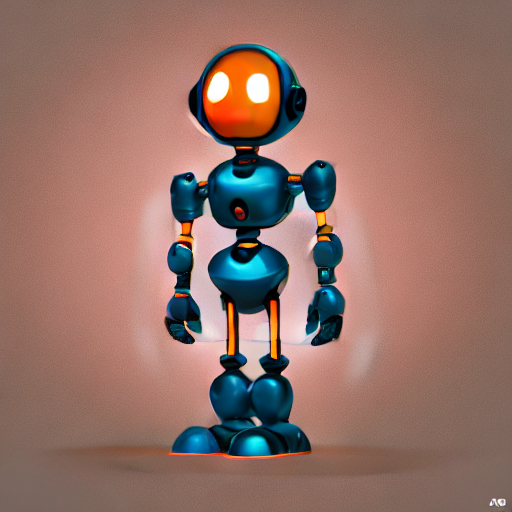
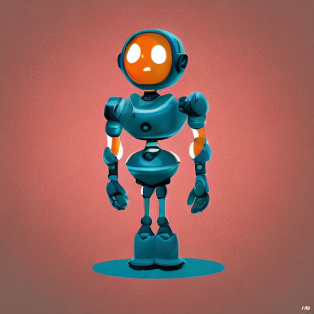

# Parameter Experiments & Observations

## 1. Model & Tools Used
**Models:**
*   **Image Generation:** Stable Diffusion 1.5 (`runwayml/stable-diffusion-v1-5`)
*   **3D Reconstruction:** TripoSR

**Why these tools?**
*   **Stable Diffusion 1.5:** Chosen for its reliability, speed, and lower hardware requirements compared to SDXL. It provides a solid baseline for generating game assets like isometric items and props.
*   **TripoSR:** Selected for its state-of-the-art speed in single-image-to-3D reconstruction. It generates meshes with textures in seconds, making it ideal for a rapid prototyping pipeline.

## 2. Parameters Tested
We conducted controlled experiments varying the following parameters:

**Base Prompt:**
> "a cute stylized robot mascot, round body, thick arms and legs, glossy metal surface, full body centered, studio lighting, 3d animation render style, smooth edges, clear silhouette"

1.  **Inference Steps:** 15, 30, 50
2.  **Guidance Scale:** 5.0, 7.5, 12.0
3.  **Seeds:** 42, 123, 999
4.  **Image Resolution:** 512x512, 768x768
5.  **Mesh Resolution (Marching Cubes):** 128, 256, 512

## 3. Observations & Results

### Key Findings
Based on the generated outputs, we identified two "sweet spots" for quality:

1.  **High Stylization:** **Guidance 12.0, Seed 999, Steps 30**.
    *   *Observation:* This combination produced very distinct, high-contrast assets. The higher guidance forced the model to adhere strictly to the "game asset" style in the prompt, resulting in cleaner silhouettes which are crucial for 3D reconstruction.

2.  **Balanced Detail:** **Guidance 7.5, Seed 123, Steps 50**.
    *   *Observation:* Increasing steps to 50 smoothed out noise, while keeping guidance at the default 7.5 allowed for more creative interpretation of textures. This resulted in a more natural-looking asset.

### General Trade-offs
*   **Steps:** Increasing steps from 15 to 30 showed a significant jump in quality. Going from 30 to 50 yielded diminishing returns for simple objects but helped with texture clarity.
*   **Guidance:** Low guidance (5.0) often resulted in "dreamy" or ill-defined edges, which confused the 3D reconstructor. High guidance (12.0) created sharp edges perfect for low-poly styles.
*   **Mesh Resolution:** Increasing TripoSR resolution from 128 to 256 significantly reduced "blobbiness" in the geometry but increased the file size and processing time.

## 4. Future Improvements (What's Next?)
With more time and resources, I would implement:
1.  **Multi-View Generation:** Instead of single-view, use models like MVDream or Zero123 to generate 4 orthogonal views before meshing to ensure the back of the object is accurate.
2.  **PBR Texture Maps:** Currently, we only bake a diffuse map. Generating Normal, Roughness, and Metallic maps would make the assets game-ready for modern engines like Unity/Unreal.
3.  **Automated LODs:** Integrate a mesh decimation step to automatically generate Low, Medium, and High poly versions of the asset.

## 5. Visual Comparison Matrix

### Experiment 1: Steps Variation (Guidance 7.5)
*Comparing how inference steps affect detail and noise.*

| Seed | Steps 15 | Steps 30 | Steps 50 |
| :---: | :---: | :---: | :---: |
| **42** |  |  |  |
| **123** |  |  |  |
| **999** |  |  |  |

### Experiment 2: Guidance Variation (Steps 30)
*Comparing how adherence to prompt affects style and silhouette.*

| Seed | Guidance 5.0 | Guidance 7.5 | Guidance 12.0 |
| :---: | :---: | :---: | :---: |
| **42** |  |  |  |
| **123** |  |  |  |
| **999** |  |  |  |

### Experiment 6: Mesh Quality (Marching Cubes Resolution)
*Comparing geometric fidelity.*

| Seed | Resolution 128 | Resolution 256 |
| :---: | :---: | :---: |
| **42** |  [View GLB](experiments/mesh_quality/mesh_res_128/seed_42.glb) |  [View GLB](experiments/mesh_quality/mesh_res_256/seed_42.glb) |
| **123** |  [View GLB](experiments/mesh_quality/mesh_res_128/seed_123.glb) |  [View GLB](experiments/mesh_quality/mesh_res_256/seed_123.glb) |
| **999** |  [View GLB](experiments/mesh_quality/mesh_res_128/seed_999.glb) |  [View GLB](experiments/mesh_quality/mesh_res_256/seed_999.glb) |

## 6. Blender Analysis
We imported the generated meshes into Blender to inspect the topology and texture quality.

### High Quality Mesh (Resolution 512) - Best Result
*Note the smoother surface and cleaner topology.*

**Technical Analysis:**
The generated mesh is not watertight and has a high Euler number, which is expected for single-view reconstruction models such as TripoSR. However, the mesh exhibits consistent winding, valid UV textures, and relatively high geometric detail (≈335k faces). Overall, the mesh is of good quality for visualization and demonstrates effective 3D structure recovery given only a single input image.

**Interactive Preview (GitHub Pages):** https://ashparmar.github.io/q-9ite/docs/viewer.html

### Standard Mesh (Resolution 256)

### Draft Mesh (Resolution 128)

